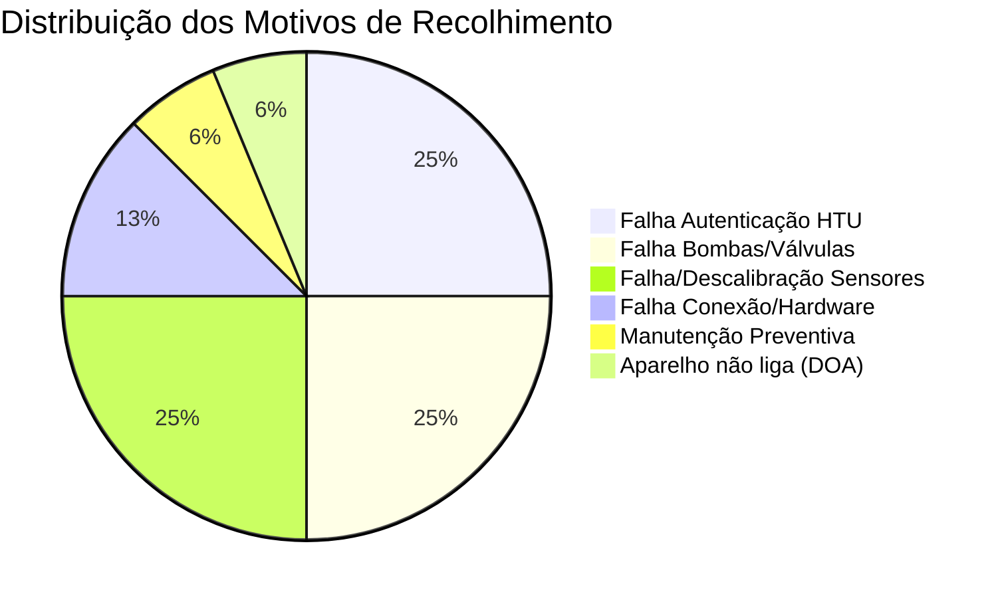
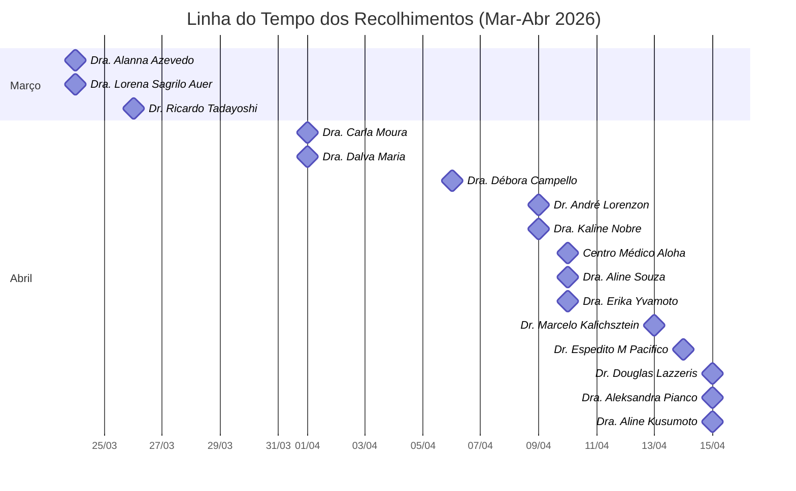

# Relatório Consolidado — Principais Motivos de Recolhimento de Aparelhos HealthGo Air

**Data de emissão:** 16/04/2026  
**Base de dados:** 16 Relatórios N3 (Registro de Investigação de Produto — FRGH.049)  
**Período analisado:** 24/03/2026 a 15/04/2026  
**Produto:** HealthGo Air  
**Analista responsável nos relatórios:** André Luiz de Souza

---

## 1. Resumo Executivo

Foram analisados **16 relatórios N3** de investigação de produto. Todos os casos resultaram em **recolhimento do equipamento**. A análise identificou **5 categorias principais de falha**, sendo a mais recorrente a **falha de autenticação do HTU** (25%), seguida por **falha nas bombas pneumáticas** (25%) e **falha/descalibração de sensores** (25%).

---

## 2. Ranking de Motivos de Recolhimento

| # | Categoria de Falha | Qtd. | % do Total | Gravidade |
|---|---|:---:|:---:|:---:|
| 1 | 🔴 Falha de Autenticação do HTU (LED vermelho) | **4** | **25%** | Crítica |
| 2 | 🟠 Falha nas Bombas Pneumáticas / Válvulas | **4** | **25%** | Crítica |
| 3 | 🟡 Falha / Descalibração de Sensores | **4** | **25%** | Alta |
| 4 | 🔵 Falha de Conexão / Hardware Geral | **2** | **12,5%** | Alta |
| 5 | 🟢 Manutenção Preventiva (250 exames) | **1** | **6,25%** | Programada |
| 6 | ⚪ Aparelho não liga (DOA) | **1** | **6,25%** | Crítica |
|   | **TOTAL** | **16** | **100%** | — |

---

## 3. Detalhamento por Categoria

### 3.1 🔴 Falha de Autenticação do HTU (4 casos — 25%)

O HTU (módulo de autenticação do hardware) não autentica no software nem na autenticação padrão do aparelho, resultando em **LED vermelho piscando** e impossibilidade de uso.

| Cliente | Data | Nº Série | HGID | Observações |
|---|---|---|---|---|
| Centro Médico Aloha | 10/04/2026 | 202506240015 | 25062512 | Go Premium: SIM. Falha identificada via terminal debug |
| Dra. Carla Moura (Neurogastro) | 01/04/2026 | 202602270001 | 26022404 | Equipamento **novo**, falhou no treinamento |
| Dra. Débora Campello | 06/04/2026 | 202601150002 | 26010804 | Falha identificada nos logs do debug |
| Dra. Kaline Nobre | 09/04/2026 | 202509260008 | 26021005 | Possível deslocamento na placa ou falha de encaixe |

> [!WARNING]
> **Ponto crítico:** O caso da Dra. Carla Moura é particularmente preocupante — trata-se de um **equipamento novo que falhou já no treinamento**, indicando possível falha de fabricação/montagem no controle de qualidade.

**Ações tentadas sem sucesso:** Verificação de porta COM, atualização de drivers, reset de firmware, SVM.

---

### 3.2 🟠 Falha nas Bombas Pneumáticas / Válvulas (4 casos — 25%)

As bombas pneumáticas travaram, resultando em ausência de sons, valores repetidos nas amostras e impossibilidade de realizar limpezas automáticas.

| Cliente | Data | Nº Série | HGID | Observações |
|---|---|---|---|---|
| Dr. André Lorenzon | 09/04/2026 | 202506270006 | 25062913 | Go Premium. Bombas funcionaram brevemente após firmware e pararam |
| Dr. Marcelo Kalichsztein | 13/04/2026 | 202503020007 | 25062423 | Go Premium: NÃO. Bombas travaram fechadas, válvulas OK |
| Dra. Alanna Azevedo | 24/03/2026 | 202512290005 | 26011310 | Nunca houve resultados positivos de CH4 |
| Dra. Dalva Maria Alcantara (Gastrocentro) | 01/04/2026 | 202511240003 | 25101707 | Sem barulho ao ligar/desligar. Valores H2 = CH4 constantes |

> [!IMPORTANT]
> **Padrão identificado:** Em todos os casos, o sintoma inicial reportado pelo cliente foi a **ausência de sons** ou **valores repetidos**, indicando que as bombas pneumáticas são um componente de alto risco de falha.

**Ações tentadas sem sucesso:** Update de firmware, SVM, desligar/ligar, reinicialização.

---

### 3.3 🟡 Falha / Descalibração de Sensores (4 casos — 25%)

Sensores operando fora dos parâmetros de calibração, gerando valores incorretos, curvas flat ou leituras erradas.

| Cliente | Data | Nº Série | HGID | Observações |
|---|---|---|---|---|
| Dr. Douglas Lazzeris | 15/04/2026 | 202507300012 | 26031803 | Sensor fora dos limites do conversor MCP3564. **Aparelho recolhido anteriormente e reenviado** |
| Dr. Espedito M Pacifico | 14/04/2026 | 202506100007 | 26022301 | Go Premium: NÃO. Falha na placa dos sensores da câmara |
| Dra. Aline Souza (Endoclin) | 10/04/2026 | 202602240001 | 26012320 | Valores H2 marcando errado. Curvas flat após SVM |
| Dra. Lorena Sagrilo Auer | 24/03/2026 | 202509100003 | 25082508 | Sensores TGS2600 e TGS2611 fora dos parâmetros. **Retornou da calibração de 1 ano ruim** |
| Dra. Aleksandra Pianco Leal | 15/04/2026 | 202508130003 | 25080803 | Calibração feita com quantidade maior de gás (pré-modificações) |

> [!CAUTION]
> **Reincidências graves:**
> - **Dr. Douglas Lazzeris:** Aparelho que já havia sido recolhido anteriormente e retornou com falha.
> - **Dra. Lorena Sagrilo Auer:** Equipamento recolhido para calibração de 1 ano/250 exames e retornou à médica com defeito.
> 
> Esses casos indicam falhas no processo de reparo/calibração na fábrica.

---

### 3.4 🔵 Falha de Conexão / Hardware Geral (2 casos — 12,5%)

Falhas que envolvem problemas de conexão com o software ou componentes de hardware diversos (LED queimado, etc.).

| Cliente | Data | Nº Série | HGID | Observações |
|---|---|---|---|---|
| Dra. Erika Yvamoto | 10/04/2026 | 202506100006 | 25061223 | LED queimado, falha de conexão com software |

---

### 3.5 🟢 Manutenção Preventiva (1 caso — 6,25%)

Recolhimento programado por atingimento do limite de exames/tempo.

| Cliente | Data | Nº Série | HGID | Observações |
|---|---|---|---|---|
| Dra. Aline Kusumoto | 15/04/2026 | 202504280005 | 25051622 | Atingiu 250 exames, calibração fora de conformidade |

---

### 3.6 ⚪ Aparelho Não Liga — DOA (1 caso — 6,25%)

Equipamento que não apresenta nenhum sinal de funcionamento.

| Cliente | Data | Nº Série | HGID | Observações |
|---|---|---|---|---|
| Dr. Ricardo Tadayoshi | 26/03/2026 | 202601020003 | 25123007 | Compra modelo combo. Deveria ter recebido comodato há 4 meses — nunca funcionou |

> [!WARNING]
> O equipamento do Dr. Ricardo Tadayoshi ficou aparentemente **4 meses sem uso** antes de se constatar que não funcionava, o que pode indicar falha na logística de ativação/acompanhamento pós-venda.

---

## 4. Estatísticas Gerais

| Indicador | Valor |
|---|---|
| Total de recolhimentos | 16 |
| Falhas corretivas (não programadas) | 15 (93,75%) |
| Manutenção preventiva | 1 (6,25%) |
| Casos com Go Premium | 3 (18,75%) |
| Casos de reincidência (recolhimento anterior) | 2 (12,5%) |
| Equipamentos novos com falha | 1 (6,25%) |
| Tentativas de SVM sem sucesso | 10+ casos |

---

## 5. Linha do Tempo dos Recolhimentos

> [!NOTE]
> Há uma clara **concentração de recolhimentos na primeira quinzena de abril/2026** (13 de 16 casos), sugerindo um possível lote problemático ou degradação temporal de componentes.

---

## 6. Pontos de Atenção e Recomendações

### 🔴 Críticos

1. **Bombas Pneumáticas (25% das falhas):** Componente com alta taxa de falha. Recomenda-se revisão do fornecedor, dos materiais e do processo de montagem desse componente.

2. **Autenticação HTU (25% das falhas):** A autenticação do módulo HTU é o segundo maior motivo de recolhimento. Investigar se há relação com lotes específicos de placas ou com o processo de encaixe/soldagem.

3. **Reincidências pós-reparo (12,5%):** Dois equipamentos retornaram da fábrica e falharam novamente. O processo de Quality Assurance pós-reparo precisa ser reforçado.

### 🟠 Importantes

4. **Calibração de sensores (25%):** Alto índice de descalibração sugere necessidade de revisão do processo de calibração na fábrica e possível redução do intervalo de manutenção preventiva.

5. **SVM com baixa eficácia:** Na grande maioria dos casos, o procedimento de SVM não resolveu o problema, indicando que as falhas tendem a ser de **hardware** e não de **software/firmware**.

6. **Equipamento DOA (Dr. Ricardo Tadayoshi):** Revisar processo de ativação pós-venda para garantir que o equipamento seja testado imediatamente após recebimento.

### 🟡 Melhorias

7. **Monitoramento proativo:** Implementar alertas automáticos no dashboard quando parâmetros de sensores ou bombas saírem dos limites esperados, antecipando a falha antes que o cliente reporte.

8. **Rastreabilidade por lote:** Cruzar os números de série dos aparelhos com falha para identificar se pertencem a lotes de fabricação específicos.

---

## 7. Conclusão

Os **três principais motivos de recolhimento** — falha de autenticação HTU, falha nas bombas pneumáticas e descalibração de sensores — representam juntos **75% de todos os casos** e apontam predominantemente para **falhas de hardware**. A concentração temporal dos recolhimentos e os casos de reincidência pós-reparo são sinais de alerta que demandam ação imediata na cadeia de produção e controle de qualidade.
